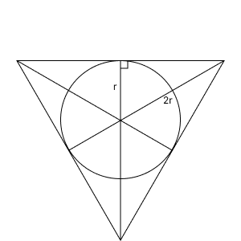

# ドローネ三角分割(Delaunay Triangulation)

アルゴリズムは以下に示したが、`scipy.spatial`の`Delaunay`を利用している。

### アルゴリズム
1. とある点の集合すべてを含むような巨大な三角形を追加する
    1. 点集合をすべて囲うような矩形を追加
    2. 矩形を囲うような円を追加
        * 中心座標 $(c_x, c_y)=(|min_x+max_x|/2, |min_y+max_y|/2)$
        * 半径 $r=\sqrt{|min_x-max_x|^2+|min_y-max_y|^2} / 2$
    3. 円に外接する正三角形を追加
        * 中心座標 $(c_x, c_y)$
        * 中心から各頂点までの距離 $2r$
        


2. 点集合のうち、i番目の点（Pi）を三角形分割図形に追加（初期であれば、巨大三角形の中に集合の中のどれかの点を入れるところから開始）
    
    1. 点Piを含む三角形ABCを見つけ (※1)、点Piを使ってその三角形を分割する（ABPi,BCPi, CAPiの3つの三角形）  
    このとき、辺AB, BC, CAをスタックに積む（仮にスタックをSとする）
    
    2. スタックSが空になるまで以下を繰り返す

        1. スタックSの一番上のedgeをpopする。これを辺ABとする

        2. 辺ABを含む2個の三角形をABC, ABDとする  
        三角形ABCの外接円にDが含まれる場合は、辺ABをフリップし、辺AD/DB/BC/CAをスタックSにpushする  
        そうでないなら処理をスキップする

3. super triangleとそれに関する頂点を破棄する（巨大三角形は処理をシンプルにするための架空のものなのでそれを消去する）


> 参考
> * https://qiita.com/edo_m18/items/7b3c70ed97bac52b2203  
> * https://tercel-sakuragaoka.blogspot.com/2011/06/processingdelaunay_3958.html  


## 重心座標系(Barycentric coordinate system)

ある三角形に内包されている点について、標高を線形補間で求める。

### 数式等
任意の点を $P$ ，点 $P$ を内包する三角形の頂点をそれぞれ $A, B, C$ とする．またそれぞれの点の標高(重み)は $P_h, A_h, B_h, C_h$ とする．  
重心座標系を用いると任意の点 $P$ の座標・標高は以下のように表せる．

```math
\begin{align*}
P &= \lambda_1 A + \lambda_2 B + \lambda_2 C \\
P_h &= \lambda_1 A_h + \lambda_2 B_h + \lambda_2 C_h \\
\end{align*}
```

&emsp;

そして $\lambda_1, \lambda_2, \lambda_3$ は以下のように求められる．  
面積を $area()$ として， 

```math
\begin{align*}
\lambda_1 = area(PBC) / area(ABC) \\
\lambda_2 = area(APC) / area(ABC) \\
\lambda_3 = area(ABP) / area(ABC) \\
\end{align*}
```

となる．また

```math
\begin{align*}
1 = \lambda_1 + \lambda_2 + \lambda_3
\end{align*}
```

である．

ここで面積はベクトルの外積を用いて求めた．  
例)

```math
\begin{align*}
area(ABC) = \frac{1}{2} AB \times AC
\end{align*}
```

> 参考  
> * https://en.wikipedia.org/wiki/Barycentric_coordinate_system


